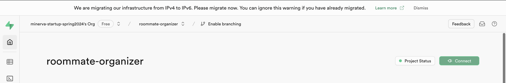
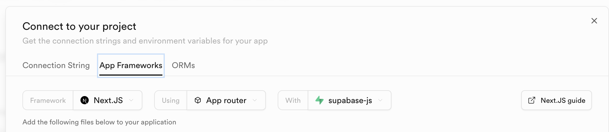

This is a [Next.js](https://nextjs.org/) project bootstrapped with [`create-next-app`](https://github.com/vercel/next.js/tree/canary/packages/create-next-app).

## Getting Started

First visit the [Next.js](https://nextjs.org/) website and download Next.js for your operating system. 

Then, install all of the dependencies as listed in the `package.json` file:

```bash
npm install
```

Then, you will need to set the database credentials as local environment variables. Login to our [Supa base account](https://supabase.com/). You can do this by using our admin Github account. You can find the Github credentials in our [Notion page](https://www.notion.so/bathientran/Roommate-Organizer-f3329359a9724554b9c678dedf549d86?p=bb905a6dd79945ea941990146400f6f2&pm=s). 

Once you log in, go to the "roommate-organizer" project. Click on the green "Connect" button in the top right. 


Then go to "App Frameworks" (choose Node.js)
and you will see an example of a `env.local` file with credentials for `NEXT_PUBLIC_SUPABASE_URL` and `NEXT_PUBLIC_SUPABASE_ANON_KEY`. It looks like this:



Create your own `.env.local` file at the root of the repo and copy-paste the credentials there. 

Then, run the development server:

```bash
npm run dev
# or
yarn dev
# or
pnpm dev
# or
bun dev
```

Open [http://localhost:3000](http://localhost:3000) with your browser to see the result.

You can start editing the page by modifying `app/page.js`. The page auto-updates as you edit the file.

This project uses [`next/font`](https://nextjs.org/docs/basic-features/font-optimization) to automatically optimize and load Inter, a custom Google Font.

## Learn More

To learn more about Next.js, take a look at the following resources:

- [Next.js Documentation](https://nextjs.org/docs) - learn about Next.js features and API.
- [Learn Next.js](https://nextjs.org/learn) - an interactive Next.js tutorial.

You can check out [the Next.js GitHub repository](https://github.com/vercel/next.js/) - your feedback and contributions are welcome!

## Deploy on Vercel

The easiest way to deploy your Next.js app is to use the [Vercel Platform](https://vercel.com/new?utm_medium=default-template&filter=next.js&utm_source=create-next-app&utm_campaign=create-next-app-readme) from the creators of Next.js.

Check out our [Next.js deployment documentation](https://nextjs.org/docs/deployment) for more details.

## Prisma

- `npx prisma migrate dev --name {NAME}`: Run a migration
